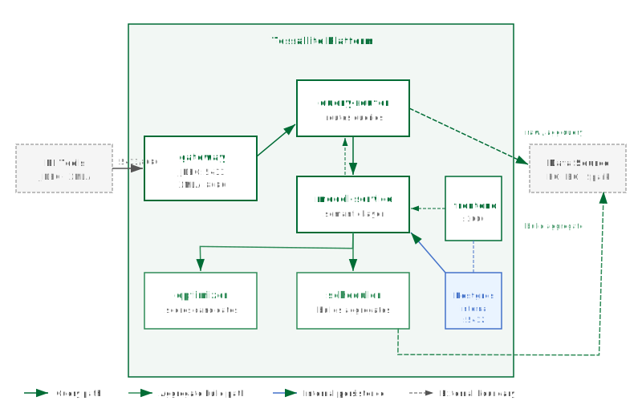

## What this covers

The six services that make up Tessallite, the internal database, how data flows through the platform, and where aggregates are physically stored.

---

## Services

### gateway

The public entry point for query traffic. Exposes two protocol endpoints: a PostgreSQL wire protocol listener on port 5433 for JDBC clients, and an XMLA listener on port 8080 for Excel and Power BI. Gateway translates incoming queries into an internal format and forwards them to query-router. It holds no query state between requests.

### query-router

Receives translated queries from gateway. For each query, query-router asks model-service whether a pre-built aggregate can satisfy it. If a matching aggregate exists and is fresh, query-router rewrites the query to target that aggregate. Otherwise the original query goes directly to the data source.

### model-service

The semantic layer. Stores the definitions of tables, joins, dimensions, measures, and aggregates. When query-router asks whether an aggregate can answer a query, model-service evaluates the request against the registered definitions and responds with a routing decision. All model data is persisted in the internal PostgreSQL database.

### optimizer

Reads the query miss log written by model-service. A miss is recorded each time query-router had to fall back to the raw data source because no aggregate matched. Optimizer scores candidate aggregates by return on investment and surfaces those exceeding the score threshold as build recommendations in the frontend.

### scheduler

Builds and refreshes aggregate tables in the user's target schema on their data source. Runs on a configurable cron schedule and can also be triggered on demand. Scheduler reads aggregate definitions from model-service and executes the build queries against the source.

### frontend

Web interface served on port 3000. Used by System Admins, Workspace Admins, and Data Analysts for model building, aggregate management, connection setup, and platform monitoring.

---

## Internal PostgreSQL database

Tessallite runs its own PostgreSQL instance (port 5432, internal only) to store operational state. This database holds workspace metadata, semantic model definitions, aggregate build history, and the query miss log. It does not store any of the user's source data or the content of aggregate tables.

> The internal PostgreSQL database is not exposed outside the container network. No BI tool or user application should connect to it directly.

---

## Data flow

1. A BI tool sends a query to gateway via JDBC (port 5433) or XMLA (port 8080).
2. Gateway translates the query and forwards it to query-router.
3. Query-router asks model-service whether any registered aggregate satisfies the query.
4. If an aggregate matches: query-router rewrites the query to target the aggregate table and returns results.
5. If no aggregate matches: query-router routes the query to the raw source tables, records a miss, and returns results.
6. Results travel back through gateway to the BI tool.

---

## Where aggregates live

Aggregate tables are written to the user's own data source — in the target schema the user specifies when configuring the connection. They are not stored in Tessallite's internal PostgreSQL. Tessallite only stores the definition and build status of each aggregate.

---

## Stateless service design

All six services keep no local state. All persistent state lives in the internal PostgreSQL database. Any service can be stopped, restarted, or replaced without data loss.

---

## Port summary

| Service | Default port | Protocol | Used by |
|---|---|---|---|
| gateway (JDBC) | 5433 | PostgreSQL wire | BI tools via JDBC |
| gateway (XMLA) | 8080 | HTTP/XMLA | Excel, Power BI via XMLA |
| frontend | 3000 | HTTP | All users (web browser) |
| Internal PostgreSQL | 5432 | PostgreSQL | Services only — not exposed externally |

---

## Related

- [Deploy Locally](deploy-local.md)
- [Deploy on GCP](deploy-gcp.md)
- [Service Reference](service-reference.md)
- [Configure Environment Variables](configure-environment-variables.md)

---

← [Model Configuration](../admin/model-configuration.md) | [Home](../index.md) | [Deploy Locally →](deploy-local.md)
