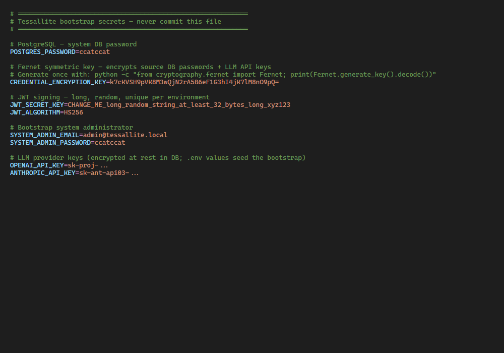

# Credentials and the .env file

**Audience:** System Admin · **Updated:** 2026-04-18



## Why credentials are not in the UI

By design, no credential is ever stored in the database-backed settings tables. Source database passwords, LLM API keys, the Fernet encryption key, the JWT signing key, and the bootstrap administrator password all live in `.env` on the host. The UI surfaces them in the System Configuration page's read-only Bootstrap panel — masked — so an operator can verify what is in effect without exposing any secret.

This separation keeps two important properties true:

- Database snapshots, audit logs, and replication streams never contain a plaintext credential.
- Rotating a credential is a host-level operation (edit `.env`, restart) that does not require touching the database.

## Required variables

| Variable | Purpose |
|---|---|
| `CREDENTIAL_ENCRYPTION_KEY` | Fernet symmetric key used to encrypt every source-DB and LLM provider credential at rest. Generate once with `python -c "from cryptography.fernet import Fernet; print(Fernet.generate_key().decode())"` and never change it without re-encrypting every existing row. |
| `JWT_SECRET_KEY` | HMAC signing key for issued JWTs. Long, random, and unique per environment. Rotation invalidates every active session. |
| `POSTGRES_PASSWORD` | System database password. Used in the constructed DSN unless `SYSTEM_DATABASE_URL` is set explicitly. |
| `SYSTEM_ADMIN_EMAIL` | Login email for the bootstrap system administrator. Default `admin@tessallite.local`. |
| `SYSTEM_ADMIN_PASSWORD` | Password for the bootstrap system administrator. |

## Optional but recommended

| Variable | Purpose |
|---|---|
| `SYSTEM_DATABASE_URL` | Full DSN override when PostgreSQL lives outside the docker-compose stack. |
| `JWT_ALGORITHM` | JWT signing algorithm. Default `HS256`. |
| `JDBC_PORT`, `XMLA_PORT` | Gateway listen ports. Defaults `5433` and `8080`. |
| `QUERY_ROUTER_URL`, `MODEL_SERVICE_URL`, `OPTIMIZER_URL` | Internal service URLs. Defaults assume the docker-compose service names. |
| `CORS_ORIGINS` | Comma-separated CORS allow-list. Set to override the default loopback list entirely. |
| `CORS_LAN_IP` | Optional LAN IP that gets prepended to the default CORS list (handy for testing the SPA from another machine on the same network without overriding the whole list). |

## LLM provider keys

LLM API keys are never written to the database settings tables. When you create an **LLM Provider Config** row from the Model Builder Settings panel, the API key you supply is encrypted with `CREDENTIAL_ENCRYPTION_KEY` before it is stored in `llm_provider_configs`. To seed the bootstrap value, set the relevant variable in `.env` (e.g. `OPENAI_API_KEY`, `ANTHROPIC_API_KEY`, `DEEPSEEK_API_KEY`) and the bootstrap script reads it.

The non-secret routing fields — provider base URLs, model-name suggestions, the Anthropic API version header — live in `system_settings` under the `llm.*` keys and are editable from System Admin → Configuration.

## Rotating a secret

1. Edit `.env` on the host with the new value.
2. Restart the relevant service:

   ```
   docker compose restart model-service
   docker compose restart gateway
   docker compose restart query-router
   docker compose restart optimizer
   docker compose restart scheduler
   ```

3. For `JWT_SECRET_KEY`: every active session is invalidated; users will be prompted to log in again.
4. For `CREDENTIAL_ENCRYPTION_KEY`: do **not** change this without re-encrypting every existing source credential. There is no automatic re-key.

## What lives where

| Item | Lives in |
|---|---|
| Source DB passwords (per project_connection) | `project_connections.encrypted_credentials` — encrypted with `CREDENTIAL_ENCRYPTION_KEY` |
| LLM API keys (per llm_provider_config) | `llm_provider_configs.encrypted_api_key` — encrypted with the same key |
| JWT signing key, Fernet key, system admin password | `.env` only |
| JWT lifetime, rate limits, scheduler cadences, etc. | `system_settings` table (editable from the UI) |

> **Never commit `.env` to source control.** The repository's `.gitignore` excludes it; `.env.example` is the safe template to commit.

## Related

- [System Configuration](system-configuration.md)
- [Configure environment variables](configure-environment-variables.md)
- [Workspace settings (tenant level)](../admin/workspace-settings.md)

---

[← System Configuration](system-configuration.md) · [Home](../index.md) · [Service reference →](service-reference.md)
