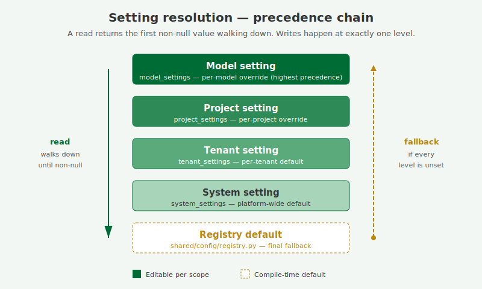
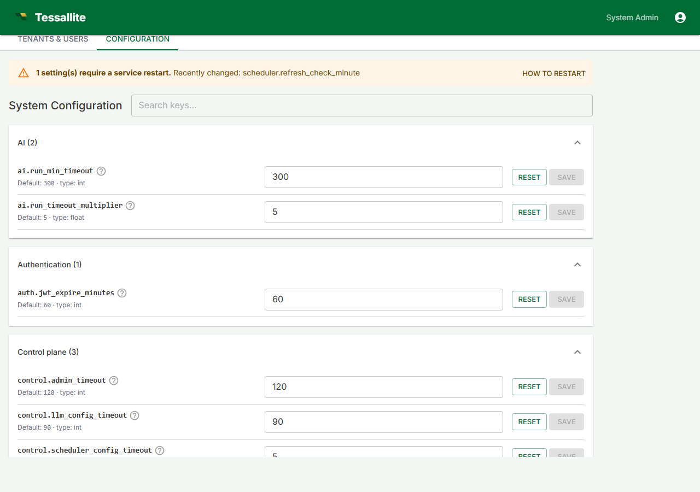
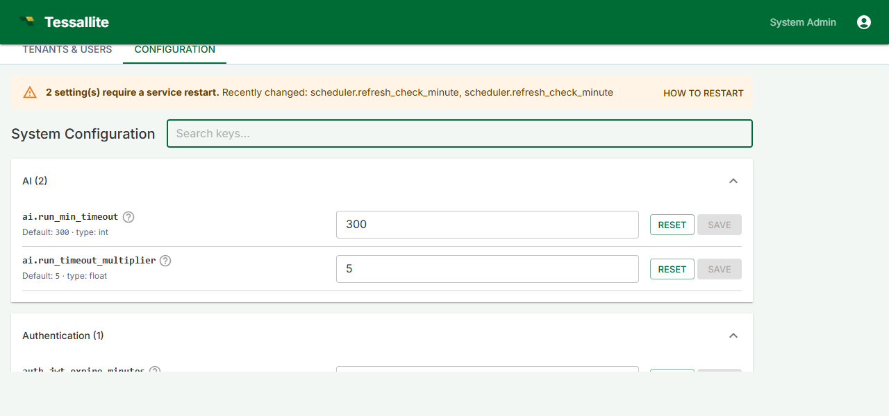
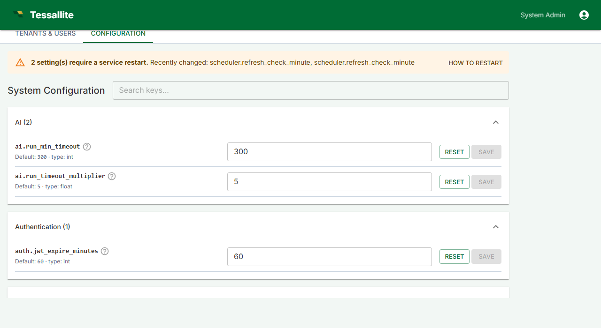

# System Configuration

**Audience:** System Admin · **Updated:** 2026-04-18





## What this covers

The Configuration tab in System Admin lets you tune every platform-wide setting that used to be hardcoded in source: scheduler cadences, gateway timeouts, rate-limit binding, XMLA session cache, optimizer thresholds, result-row caps, schema-drift cadence, LLM provider routing, and frontend defaults. It also surfaces the read-only Bootstrap (env-only) panel so you can verify the values that came from the `.env` file at process start.

## Who can edit it

Only the **system_admin** role can read or write here. Tenant admins, modelers, and viewers do not see the tab. Backend endpoints (`GET /api/v1/system/settings`, `PUT /api/v1/system/settings/{key}`) reject any other role.

## How values resolve

Every setting on this page is the platform default. A tenant admin can override individual keys at the tenant level; a project admin can further override at the project level; modelers can override at the model level. When a query, scheduler job, or API handler asks for a setting, the resolver walks **model → project → tenant → system → registry default** and returns the first non-null value. A `null` stored at any level means "explicitly unset, fall through".

## Editing a setting

1. Sign in as a system administrator and open System Admin → Configuration.
2. Use the search box at the top to filter by key, section, or description.
3. Find the setting you want to change. The default and the current value are displayed inline.
4. Edit the value, then click **Save**. **Reset** restores the registry default for that key.

## Restart-required settings



Some settings — scheduler cadences, gateway listen ports, the rate-limit binding, the XMLA session cache file, the Vite dev server, and the frontend default endpoint ports — can only take effect when the relevant service process restarts. Saving any of these flags appends an entry to the "restart-pending" list and shows a yellow banner at the top of the page listing the recently-changed keys.

The **How to restart** button on that banner opens a dialog with the docker-compose / systemd procedure. After restarting, return to the Configuration tab and click **Mark all as applied** to clear the banner.

## Bootstrap (env-only) panel



Scroll to the bottom of the Configuration tab for the read-only Bootstrap panel. Every value here comes from the host's `.env` file and is needed before the database is even reachable: the system DB DSN, the Fernet credential-encryption key, the JWT signing key, the system administrator's email and password, the gateway's JDBC and XMLA ports, the internal service URLs, and the CORS allow-list. Secrets are masked (`***** (32 chars)`) and the DSN's password is redacted, so a passing operator can verify what is in effect without exposing credentials.

To change any of these values, edit `.env` on the host and restart the affected service (or the whole stack with `docker compose restart`). See [Credentials and the .env file](credentials-and-env.md) for the full procedure.

## Per-key reference

The complete catalog of every system-level key, its type, default, restart flag, and description is generated from the registry at `docs/guides/guides_configuration-reference.md`. Regenerate after any registry change with:

```
python tessallite/scripts/gen_config_reference.py
```

## Related

- [Credentials and the .env file](credentials-and-env.md)
- [Workspace settings (tenant level)](../admin/workspace-settings.md)
- [Project settings](../admin/project-settings.md)
- [Model configuration](../admin/model-configuration.md)

---

[← Configure environment variables](configure-environment-variables.md) · [Home](../index.md) · [Credentials and the .env file →](credentials-and-env.md)
