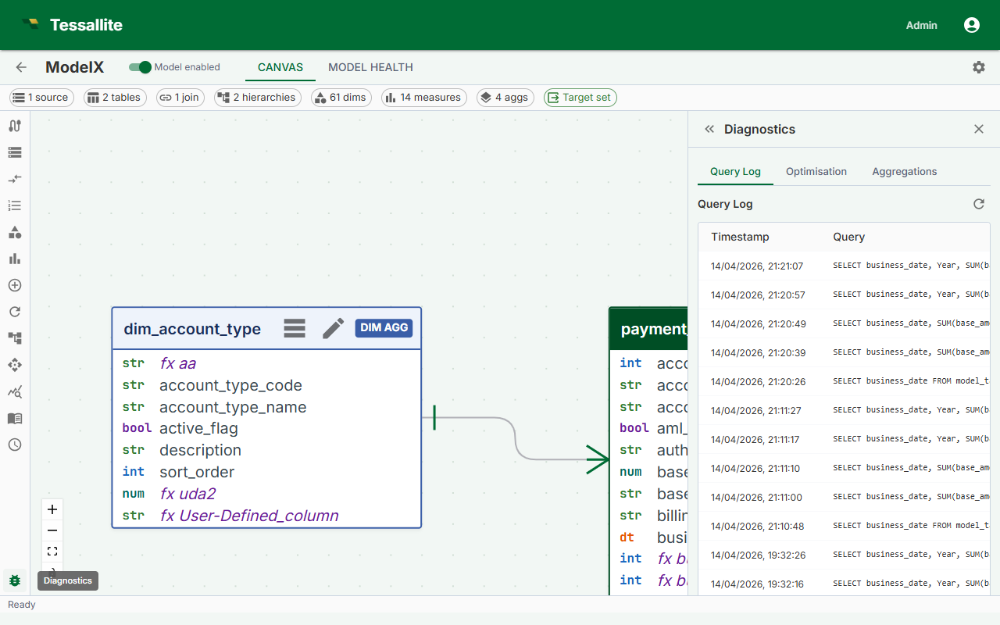

## What this covers

Diagnosing situations where aggregates fail to build, are stuck building, or never appear. Aggregates are built by the Tessallite Scheduler service. Most failures trace back to a connectivity, permission, or configuration problem.

---

## Symptom reference

| Symptom | Likely cause | Resolution |
|---------|-------------|------------|
| Aggregate stuck in "Building" for >30 minutes | Scheduler service crashed | Check: `docker compose ps scheduler`. If Exit/Restarting, read logs: `docker compose logs --tail=50 scheduler`. Restart: `docker compose restart scheduler`. |
| Aggregate status shows "Error" | Build query failed | Model Builder → Health tab → "Aggregate build failed" → expand for error message. |
| "write permission denied on target schema" | DB user cannot write to aggregate target schema | Grant `CREATE TABLE`, `INSERT`, `DROP TABLE` on target schema to the Tessallite database user. |
| "source query timeout" | Source query exceeded timeout during aggregate build | Increase query timeout in Workspace Settings, or reduce the aggregate grain. |
| "source connection refused" | Source data source not reachable | Verify source connection params in project settings. Confirm source DB is running and reachable from Tessallite host. |
| No new aggregates after AI Optimizer run | Miss log is empty — no queries captured yet | Run several queries via a BI tool first, then re-open Optimizer. |
| AI Optimizer suggests nothing with query history | Score threshold too high | Reduce `OPTIMIZER_SCORE_THRESHOLD` env var and restart Optimizer service. |
| Existing aggregate disappears | Optimizer retired unused aggregate | Re-create manually in Model Builder, or lower the retirement threshold. |

---

## View Scheduler logs

```
docker compose logs -f scheduler
```

The `-f` flag streams new lines. Press Ctrl+C to stop. Look for `ERROR` or `FATAL` entries.

For Cloud Run or other managed deployments, access logs through the platform's log viewer filtered by the scheduler service name.

---

## Common permission grant (PostgreSQL)

Run as a database superuser:

```sql
GRANT USAGE ON SCHEMA target_schema TO tessallite_user;
GRANT CREATE ON SCHEMA target_schema TO tessallite_user;
GRANT INSERT, SELECT, DROP ON ALL TABLES IN SCHEMA target_schema TO tessallite_user;
```

Replace `target_schema` and `tessallite_user` with the values from your data source configuration.

---

## Related

- [Query Returns Wrong Results](query-returns-wrong-results.md)
- [Service Not Starting](service-not-starting.md)
- [Common Errors](common-errors.md)
- [Supported Data Sources](../integrations/supported-data-sources.md)

---

← [Query Returns Wrong Results](query-returns-wrong-results.md) | [Home](../index.md) | [Service Not Starting →](service-not-starting.md)
