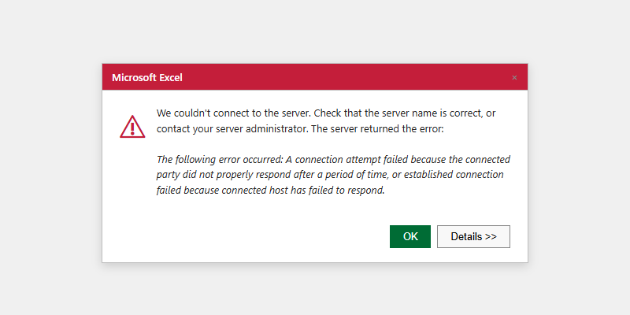

## What this covers

Diagnosing and resolving connection failures when connecting Microsoft Excel to Tessallite via the XMLA endpoint. For the connection setup procedure, see [Excel XMLA Connection Guide](../integrations/excel-xmla-connection-guide.md).

---

## Pre-connection checklist

Before troubleshooting, verify:

- Port 8080 is reachable from this machine. Test with: `curl -v http://HOST:8080/xmla`
- You have the workspace slug (obtain from your Tenant Admin — it is case-sensitive).
- You have valid Tessallite credentials (email address and password).
- You know the project name and model name you intend to query.

---

## Symptom reference

| Symptom | Likely cause | Resolution |
|---------|-------------|------------|
| "We couldn't connect to the Analysis Services server" | Wrong URL format | URL must be exactly `http://HOST:8080/xmla`. Do not omit `/xmla`. Do not use HTTPS unless SSL is configured. |
| Same error with correct URL | Port 8080 blocked or Gateway not running | Test with `curl -v http://HOST:8080/xmla`. If refused, escalate to System Admin to check Gateway service and firewall. |
| "The catalog name is invalid" | Wrong workspace slug or wrong case | Verify slug with Tenant Admin. Slug is case-sensitive. |
| "The user name or password is incorrect" | Wrong Tessallite credentials | Confirm you are using Tessallite email and password, not database credentials. Reset via Admin panel if needed. |
| "No cubes were found" | No published model in the project | Ask Modeller to publish the model in Model Builder. |
| Data looks stale | Aggregate not refreshed | Ask Modeller to check aggregate status and run a refresh if status is Stale. |
| Excel shows error after previously working | Stale cached connection | Data → Queries & Connections → Delete connection → reconnect from scratch. |

---

## Testing the XMLA endpoint directly

From a terminal on the same machine as Excel:

```
curl -v http://HOST:8080/xmla
```

Any HTTP response (even a server-side error) confirms the port is reachable. A timeout or "connection refused" is a network or service issue, not an Excel configuration issue.

---

## Related

- [Excel XMLA Connection Guide](../integrations/excel-xmla-connection-guide.md)
- [Common Errors](common-errors.md)
- [Query Returns Wrong Results](query-returns-wrong-results.md)
- [Aggregates Not Building](aggregates-not-building.md)

---

← [API Reference](../integrations/api-reference.md) | [Home](../index.md) | [Query Returns Wrong Results →](query-returns-wrong-results.md)
