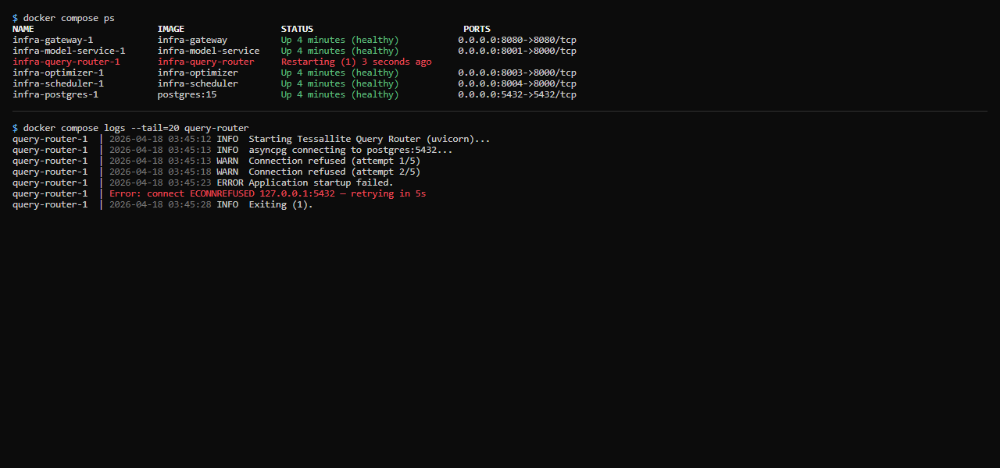

## What this covers

Diagnosing a Tessallite service that fails to start, exits immediately, or restarts in a loop. This article applies to Docker Compose deployments.

---

## General diagnostic approach

1. **Check status**: `docker compose ps` — look for Exit or Restarting status.
2. **Read logs**: `docker compose logs --tail=50 SERVICE_NAME`
3. **Fix the underlying cause** (see table below).
4. **Restart**: `docker compose restart SERVICE_NAME`
5. **Verify**: `docker compose ps` — confirm the service shows Up.

Check the health endpoint after services are up:

```
curl http://localhost:3000/api/health
```

A response of `{"status":"ok"}` confirms the Frontend service is running and can reach the database.

---

## Common causes by service

| Service | Symptom | Likely cause | Fix |
|---------|---------|-------------|-----|
| `postgres` | Exits immediately | Data directory permissions wrong or volume initialised with different user | `docker compose down -v && docker compose up -d` (warning: deletes all data volumes) |
| `model-service` | Restarts in loop | Cannot connect to internal PostgreSQL — wrong DB_HOST, DB_USER, or DB_PASS | Verify env vars in `.env`. Start postgres first, wait for healthy status, then start model-service. |
| `gateway` | Exits with "address already in use" | Another process holds port 5433 or 8080 | Stop the conflicting process, or change `GATEWAY_PORT_JDBC` / `GATEWAY_PORT_XMLA` in `.env`. |
| `frontend` | Exits with "SESSION_SECRET not set" | SESSION_SECRET env var missing from `.env` | Add `SESSION_SECRET=<long random string>` to `.env` and restart. |
| `scheduler` | Restarts after a few minutes | Cannot connect to target schema or source database | Verify source connection params and target schema permissions. See [Aggregates Not Building](aggregates-not-building.md). |
| Any service | "Cannot connect to postgres" on startup | Service started before postgres was ready | `docker compose restart SERVICE_NAME` once postgres shows healthy. |

---

## Startup order

On first run, postgres takes 10–20 seconds to initialise. If multiple services fail simultaneously after a fresh install:

```
docker compose up -d postgres
docker compose ps   # wait until postgres shows (healthy)
docker compose up -d
```

---

## Related

- [Aggregates Not Building](aggregates-not-building.md)
- [Common Errors](common-errors.md)
- [API Authentication](../integrations/api-authentication.md)

---

← [Aggregates Not Building](aggregates-not-building.md) | [Home](../index.md) | [Common Errors →](common-errors.md)
